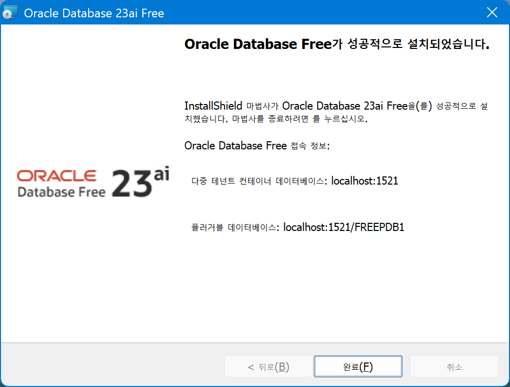

# BNK 부산은행 - SQL 튜닝 과정

2025년 07월 21일 월 ~ 07월 25일 금 / 1일 8시간 총 40시간 재직자 향상과정

# 🧭 SQL튜닝 과정 일자별 수업내용

[일자별 수업진행 내용 정리 자료](%EC%9D%BC%EC%9E%90%EB%B3%84%20%EC%88%98%EC%97%85%EC%A7%84%ED%96%89%20%EB%82%B4%EC%9A%A9%20%EC%A0%95%EB%A6%AC%20%EC%9E%90%EB%A3%8C%202385549d352880d58cb9d714cdfe1b52.md)

### ✅ 학습 도우미 - SQL 챗봇

[ChatGPT - 빠르게 배워서 응용하는 SQL 튜닝](https://chatgpt.com/g/g-687dc19c590c8191bf2e3c571e4a6989-bbareuge-baeweoseo-eungyonghaneun-sql-tyuning)

---

## 🎯 **과정 목적**

1. **SQL 튜닝의 이론과 실제를 체계적으로 학습**
    - 단순 문법 중심의 SQL이 아니라, **오라클 옵티마이저 동작 원리**, **I/O 구조**, **실행계획 분석**, **Wait Event 기반의 성능진단**을 포함한 **실무 중심 성능 튜닝 과정**입니다.
2. **실제 문제 해결 역량 강화**
    - **AWR 분석**, **실제 비효율 SQL 사례 해결**, **SwingBench 및 DB 부하 테스트 실습**을 통해 튜닝 기법을 현업에 바로 적용 가능하도록 함.
3. **Oracle 환경의 구조적 이해와 병행 학습**
    - Oracle SGA, PGA 구조, 인덱스 구조, 메모리 튜닝, 힌트 활용 등 **성능을 이해하는 기반 지식 강화**.

## **✅** **과정 학습 자료**

[SQL 튜닝 자료실](SQL%20%ED%8A%9C%EB%8B%9D%20%EC%9E%90%EB%A3%8C%EC%8B%A4%202285549d352880c19a4bc9a0fd74520b.md)

[오라클 SQL 튜닝 중급 과정 – 일자별 보고서 및 실습자료 정리](%EC%98%A4%EB%9D%BC%ED%81%B4%20SQL%20%ED%8A%9C%EB%8B%9D%20%EC%A4%91%EA%B8%89%20%EA%B3%BC%EC%A0%95%20%E2%80%93%20%EC%9D%BC%EC%9E%90%EB%B3%84%20%EB%B3%B4%EA%B3%A0%EC%84%9C%20%EB%B0%8F%20%EC%8B%A4%EC%8A%B5%EC%9E%90%EB%A3%8C%20%EC%A0%95%EB%A6%AC%202365549d352880a6a563f45447455224.md)

[오라클 SQL 튜닝 핵심 정리 (종합 요약)](%EC%98%A4%EB%9D%BC%ED%81%B4%20SQL%20%ED%8A%9C%EB%8B%9D%20%ED%95%B5%EC%8B%AC%20%EC%A0%95%EB%A6%AC%20(%EC%A2%85%ED%95%A9%20%EC%9A%94%EC%95%BD)%202365549d3528806485d0fefbb863fe40.md)

[Oracle SQL 튜닝 실무 가이드북](Oracle%20SQL%20%ED%8A%9C%EB%8B%9D%20%EC%8B%A4%EB%AC%B4%20%EA%B0%80%EC%9D%B4%EB%93%9C%EB%B6%81%202365549d35288095ba11ced704a60d62.md)

## **✅** **과정 실습 환경**

[SQL 튜닝 - 설치관련](SQL%20%ED%8A%9C%EB%8B%9D%20-%20%EC%84%A4%EC%B9%98%EA%B4%80%EB%A0%A8%202305549d3528809c979bfdbde237e47f.md)

**✅ 사용자명 입력 시**

```sql
사용자명 입력: sys as sysdba
비밀번호 입력: oracle123! <- 설치시 설정된 비밀번호 / 이후 초기값 (welcome1)로 설정.
```

접속되면 아래와 같은 메시지가 나옵니다:



## 🧭 전체 커리큘럼 개요 (5일 × 8시간 = 총 40시간) 계획안

| 일차 | 주요 주제 | 목표 |
| --- | --- | --- |
| 1일차 | SQL 처리 구조와 오라클 I/O 구조 이해 | Oracle 내부 처리 구조 및 Block 기반 I/O 구조 이해 |
| 2일차 | 실행계획 분석과 옵티마이저 동작 원리 | 실행계획 읽기, 옵티마이저 유형, 힌트 사용법 학습 |
| 3일차 | 인덱스 전략과 테이블 설계 | B-Tree 인덱스, 클러스터링 팩터, 파티셔닝 활용 실습 |
| 4일차 | SQL 튜닝 실습 및 AWR 분석 | 실전 SQL 튜닝 + AWR Report 분석 실습 |
| 5일차 | Wait Event 기반 진단과 종합 과제 수행 | 튜닝 포인트 진단 및 최적화 시나리오 수립 훈련 |

## 🧭 일자별 교수학습 지도안

[Day01 - SQL 처리 구조와 오라클 I/O 구조 이해](Day01%20-%20SQL%20%EC%B2%98%EB%A6%AC%20%EA%B5%AC%EC%A1%B0%EC%99%80%20%EC%98%A4%EB%9D%BC%ED%81%B4%20I%20O%20%EA%B5%AC%EC%A1%B0%20%EC%9D%B4%ED%95%B4%202365549d352880cdaf00e0ca81c7dcec.md)

[Day02 - 실행계획 분석과 옵티마이저 동작 원리](Day02%20-%20%EC%8B%A4%ED%96%89%EA%B3%84%ED%9A%8D%20%EB%B6%84%EC%84%9D%EA%B3%BC%20%EC%98%B5%ED%8B%B0%EB%A7%88%EC%9D%B4%EC%A0%80%20%EB%8F%99%EC%9E%91%20%EC%9B%90%EB%A6%AC%202365549d35288071b27dc73f1922f480.md)

[Day03 - 인덱스 전략과 테이블 설계](Day03%20-%20%EC%9D%B8%EB%8D%B1%EC%8A%A4%20%EC%A0%84%EB%9E%B5%EA%B3%BC%20%ED%85%8C%EC%9D%B4%EB%B8%94%20%EC%84%A4%EA%B3%84%202365549d352880ebbc8ce20887e79248.md)

[Day04 - SQL 튜닝 실습 및 AWR 분석](Day04%20-%20SQL%20%ED%8A%9C%EB%8B%9D%20%EC%8B%A4%EC%8A%B5%20%EB%B0%8F%20AWR%20%EB%B6%84%EC%84%9D%202365549d352880189200c0598d73688b.md)

[Day05 - Wait Event 기반 진단과 종합 과제 수행](Day05%20-%20Wait%20Event%20%EA%B8%B0%EB%B0%98%20%EC%A7%84%EB%8B%A8%EA%B3%BC%20%EC%A2%85%ED%95%A9%20%EA%B3%BC%EC%A0%9C%20%EC%88%98%ED%96%89%202365549d35288034af48fcfd30dab65b.md)

---

## 🎯 카카오 오픈톡 : [https://open.kakao.com/o/gbrfK7Hh](https://open.kakao.com/o/gbrfK7Hh)

### ✅ 참고 자료

1. 📘 『SQL 튜닝 중급 커리큘럼(40시간) 0721_0725.pdf』
2. 📗 『sqld 핵심요약집.pdf』 – 기초 이론 보조 교재
3. 📘 『오라클강의_PDF_교재_v1_0.pdf』 – 아키텍처, 실습, 메모리 구조, 실행계획 등 상세 자료
4. 💡 실습 환경: Oracle 23 AI Free Edition

### ✅ 친절한 SQL튜닝 교재 참고자료

[https://github.com/aebonlee/nice-sql-tuning](https://github.com/aebonlee/nice-sql-tuning)

[https://github.com/aebonlee/KindSQL_bookstudy](https://github.com/aebonlee/KindSQL_bookstudy)

[https://github.com/aebonlee/kindSqlTuning](https://github.com/aebonlee/kindSqlTuning)

[시리즈 | 친절한SQL튜닝 - grit.log](https://velog.io/@tothek/series/%EC%B9%9C%EC%A0%88%ED%95%9CSQL%ED%8A%9C%EB%8B%9D)

- 교재를 온라인 블로그 글에 다 옮겨 놓은 듯 한 velog 입니다.

### ✅ 생성형 인공지능 참고자료

- 생성형AI 활용에 참고하시면 좋을 것 같아 공유 드려요.

[생성형 AI 업무 활용 Tip!](%EC%83%9D%EC%84%B1%ED%98%95%20AI%20%EC%97%85%EB%AC%B4%20%ED%99%9C%EC%9A%A9%20Tip!%2023a5549d3528805bbc17fe7cc45cecf3.md)

[[2025 하계 한국항공대 디지털 역량 강화 캠프] 생성형 AI - A to Z 특강](https://padlet.com/aebon/2025-ai-a-to-z-gp73utbyt7mti37a)